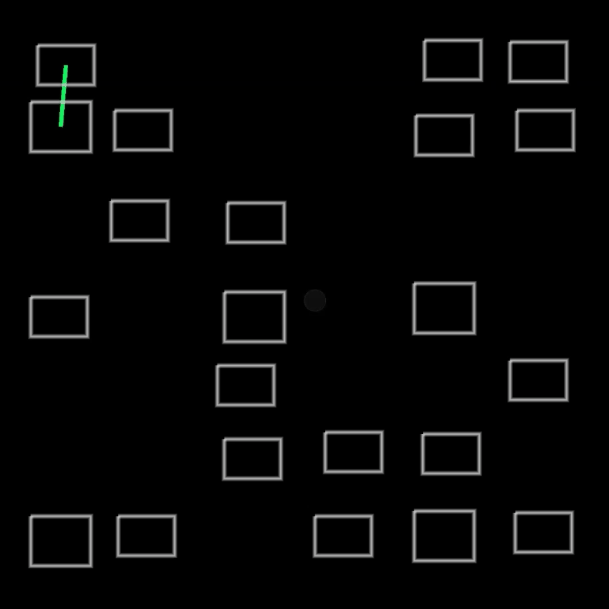
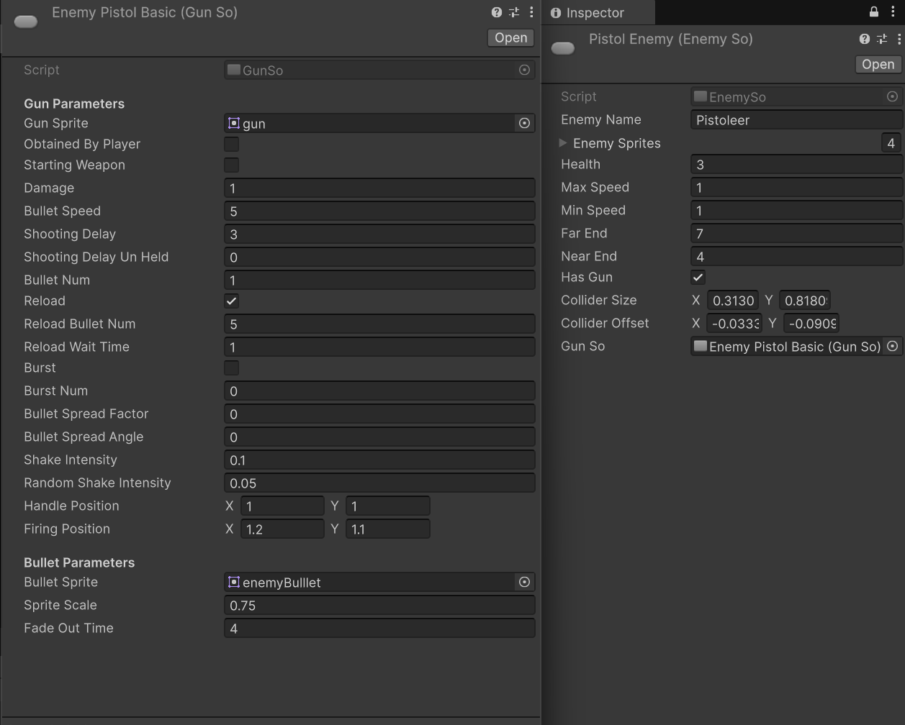
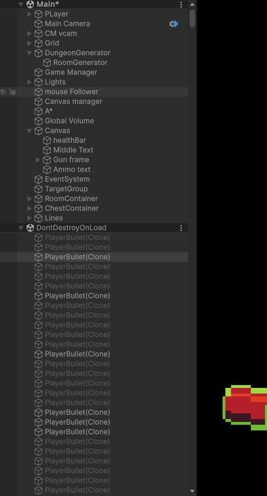

#  Isometric Procedural Dungeon Crawler

  
**A 2D roguelike project focused on procedural generation algorithms, custom memory management, and clean C# architecture.**

## Technical Highlights

*   **Procedural Dungeon Generation:** Wrote a custom layout generator using Delaunay Triangulation and Minimum Spanning Trees. It places rooms, maps out the main path, and randomly adds extra connections to create non-linear loops and then distributes Tiles on a 2D grid to create the Game World.

*   **Data-Driven Architecture:** Structured the bullet, gun, and enemy stats using Unity `ScriptableObjects`. This keeps the data completely separate from the core logic so things like fire rate and spread can be tweaked without touching the code.

*   **Object Pooling:** Implemented a custom dictionary-based object pool to recycle bullets and enemies. This pre-loads entities on awake to avoid runtime instantiation and prevent C# garbage collection lag.
  

##  Architecture Showcase

Using ScriptableObjects to keep weapon and enemy data completely modular.

  

The Object Pool preloading bullet entities on awake to save memory during gameplay by eliminating c# garbage collection.

  

##  Code Structure

If you want to check out the code, the `Assets/Scripts`. The main areas are:

- `WorldGeneration/` - The math and algorithms for the procedural mapping.
    
- `MemoryManagement/` - The Object Pooling system.
    
- `Entities/` & `ScriptableObjects/` - The data driven AI and combat scripts.